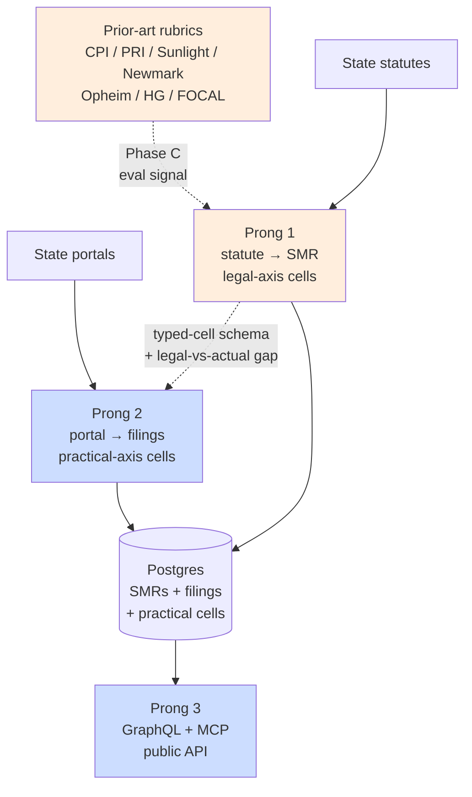
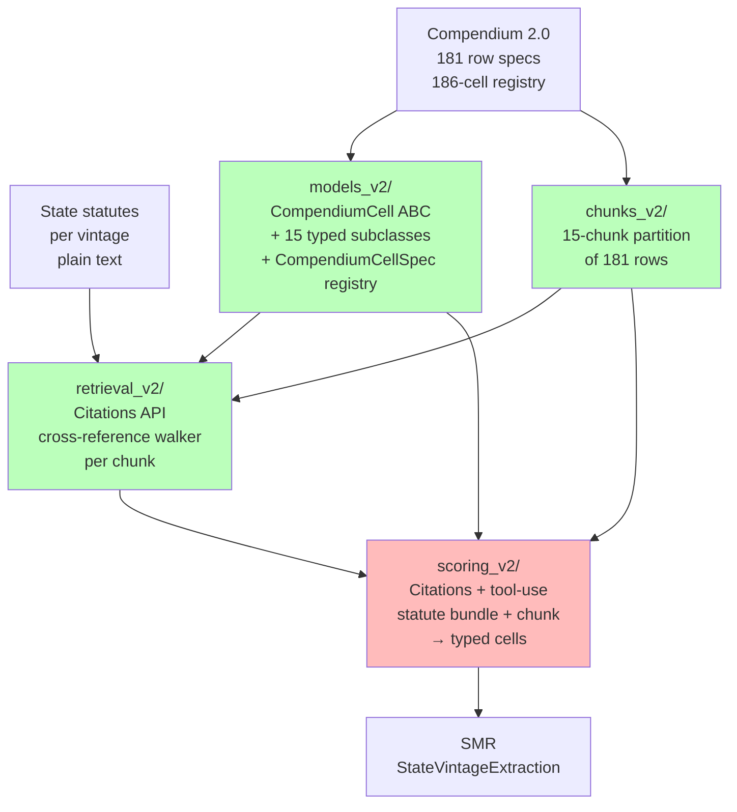
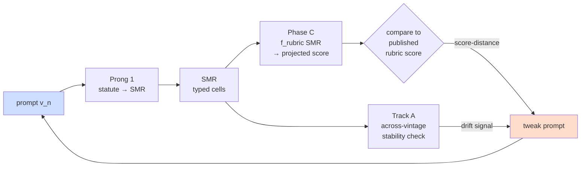

# Research Arc

Overview of the project's three prongs, the four components inside Prong 1, and the cross-track feedback loop that drives prompt iteration. This document captures *how the work fits together*; per-component depth lives in each branch's `RESEARCH_LOG.md`.

**See also:**
- `README.md` — project mission and positioning vs LobbyView / OpenSecrets / Sunlight / FOCAL
- `STATUS.md` — operational state per branch
- `docs/active/ARCHITECTURE.md` — production deployment topology (Prong 3)
- `docs/LANDSCAPE.md` — fellow-facing positioning report
- `compendium/README.md` — the 181-row contract this whole arc is built on

---

## Three prongs

**The product is Prong 2 + Prong 3** — public-facing infrastructure for state lobbying disclosure data, served via GraphQL + MCP, queried by journalists, activists, and researchers who want to see *what's actually being disclosed* and *who is trying to influence whom*.

Prong 1 (statute → SMR) is **upstream scaffolding**, not the product. It earns its keep two ways:

1. **Cheaper Prong 2.** The SMR's typed-cell schema is the common reference standard for what each state's regime *should* be disclosing. Without it, every per-state portal pipeline starts from scratch — 50 bespoke extractors with no shared semantics. With it, the per-state work collapses to mapping portal fields onto known cell types.
2. **An additional research artifact.** The gap between what the statute *requires* (legal-axis cells, filled by Prong 1) and what the portal *actually exposes* (practical-axis cells, filled by Prong 2) is itself observable and queryable. A state whose statute mandates contact-log disclosure but whose portal doesn't surface them is a story.

A **"stairs of leverage"** pattern recurs throughout the project: each layer is scaffolding for the layer above it. The same logic applies one step lower — **prior-art rubrics** (CPI 2015 C11, PRI 2010, etc.) are scaffolding that makes Prong 1 *measurably accurate* by providing indirect ground truth via Phase C projection. See the Ralph loop section below.



Legend: light blue = product; sand = scaffolding.

| Prong | What it does | Role | Status |
|---|---|---|---|
| **1. Statute → SMR** | Read a state's lobbying statutes; emit one `StateMasterRecord` per (state, vintage) — typed cells covering what the regime *legally requires*. | Scaffolding | In flight (current focus) |
| **2. Portal → disclosure data** | Read a state's lobbying portal; extract structured filings + practical-axis cells — what's *actually* disclosed. | Product | Sibling work; depends on Prong 1's typed-cell schema and prompt-harness primitives |
| **3. Display** | Serve the unified data via GraphQL API + MCP server. | Product | Designed in `docs/active/ARCHITECTURE.md`; no code yet |

Per state, Prong 1 produces one SMR per relevant statute vintage (what the regime *requires* to be disclosed). Prong 2 produces filings + practical-axis observations from the state's portal (what's *actually* disclosed). The two records share the same 181-cell typed schema — Prong 1 fills legal-axis cells from statute reading; Prong 2 fills practical-axis cells from portal observation. The legal/practical gap per row is itself observable and queryable through Prong 3.

Per-state heterogeneity lives in scrapers and prompt fixtures, not in the data shape. That's what the shared schema buys.

The rest of this document is about **Prong 1** — the scaffolding currently in flight.

---

## Prong 1 internals: Compendium 2.0 → 4 components → SMR

**Input:** State statute text (per state, per vintage) + the Compendium 2.0 row contract (181 typed-cell specs at `compendium/disclosure_side_compendium_items_v2.tsv`).

**Output:** One `StateVintageExtraction(state, vintage, run_id, cells: dict[(row_id, axis), CompendiumCell])` per (state, vintage). This is the SMR for that state-year — the typed-cell record of what the statute legally requires.



Component status:

| Component | What it is | Status |
|---|---|---|
| `models_v2/` | Frozen Pydantic ABC (`CompendiumCell`) + 15 typed subclasses + the 186-cell `CompendiumCellSpec` registry. | Shipped, tests green |
| `chunks_v2/` | Hand-curated 15-chunk partition of the 181 rows. Each chunk is the unit of prompt dispatch — one retrieval + scoring call per chunk. | Shipped, tests green |
| `retrieval_v2/` | Cross-reference walker over the statute bundle. Anthropic Citations API + tool-use surface (`record_cross_reference` / `record_unresolvable_reference`). Produces a `RetrievalOutput` per chunk with cited statute spans. | Shipped, T0 unit green; T1 smoke validated on desktop |
| `scoring_v2/` | Consumes retrieval bundle + chunk; emits typed `CompendiumCell` instances with Citations-grounded `EvidenceSpan` provenance. Final extraction component. | Brainstorm locked 2026-05-14; impl plan + impl outstanding |

The four components are deliberately decoupled — each is its own Pydantic module with a frozen surface. The shared substrate is the Compendium 2.0 row contract: every component reads the same registry and the same chunk manifest.

**Why four components, not one harness?** Each component is independently testable. `models_v2/` and `chunks_v2/` are pure data — fast unit tests, no LLM calls. `retrieval_v2/` and `scoring_v2/` use Citations API + tool use, gated by integration tests with explicit `skipif` on `ANTHROPIC_API_KEY`. The split keeps the LLM-calling components small enough that the prompt and the tool schemas are the only meaningful surface, not buried inside orchestration code.

**`StateMasterRecord` shape (the output).** A `StateVintageExtraction` carries:
- `state`, `vintage`, `run_id` — provenance
- `cells: dict[(row_id, axis), CompendiumCell]` — up to 186 entries, one per (row × axis); some rows have only `legal`, some only `practical`, five have both
- An `ExtractionRun` provenance wrapper (`run_id`, `model_version`, `prompt_sha`, `started_at`, `completed_at`)

Practical-axis cells (50 practical-only rows + practical halves of 5 dual-axis rows) live in the same SMR schema but are *populated* by Prong 2, not Prong 1. The current brief-writer brainstorm deferred the practical-axis brief-writer to a sibling component for exactly this Prong-1/Prong-2 seam reason.

---

## How Prong 1 quality is measured: the Ralph loop

Prong 1's central open question: **how accurate is the LLM's typed-cell extraction?**

There is no published 50-state ground truth at the typed-cell level — that's precisely the gap this project fills. Hand-labeling 50 states' cells from scratch doesn't scale at fellowship size.

What *does* exist is **per-state published rubric scores** from eight prior-art rubrics: CPI 2015 C11, PRI 2010, Sunlight 2015, Newmark 2017, Newmark 2005, Opheim 1991, HG 2007, FOCAL 2024. The project's **Phase C** (`phase-c-projection-tdd` branch) implements `f_rubric(SMR_cells, vintage) → projected_score` for each rubric. Projecting our extracted cells back into a rubric's published scoring rule and comparing against that rubric's published score gives an indirect-but-real accuracy signal for Prong 1.

That signal closes a Ralph loop — iterate prompts against score-distance until convergence:



Two independent error-rate signals feed the same prompt-iteration loop:

1. **Phase C cross-rubric projection-distance.** Projected vs published per-state rubric score. Catches "the LLM systematically misreads a rubric's intent" — it's reading the statute but assigning wrong typed values relative to how a published rubric would score that state.
2. **Track A within-state across-vintage stability.** Run the same pipeline against OH 2007 / 2010 / 2015 / 2025; rows whose statute language didn't change between vintages should produce identical cell values. Drift signals a prompt-stability bug (non-determinism, irrelevant-phrasing latching) independent of any rubric's interpretation.

These are complementary. Phase C catches absolute-accuracy errors; Track A catches consistency errors. A prompt revision that improves one while degrading the other deserves a second look.

**Phase C is not strictly required for Prong 1 to ship.** Prong 1 produces SMRs regardless. It is required for Prong 1 to be *measurably* good — without it, there's no way to characterize accuracy at scale, and prompt iteration has no gradient to follow.

### Phase C rubric order

`phase-c-projection-tdd` implements the eight rubric projections in a locked order. The order is mostly convenience — strongest ground truth first (highest-resolution feedback gradient, easiest to debug against), dependencies respected (Newmark 2005 reuses Newmark 2017's cell mappings; HG 2007 depends on Track A's HG retrieval sub-task), and the rubric with no per-state US ground truth goes last by elimination:

| # | Rubric | Rows | Validation regime |
|---|---|---|---|
| 1 | CPI 2015 C11 | 21 | Per-state per-item, 50 states |
| 2 | PRI 2010 | 69 | Per-state per-item, 50 states |
| 3 | Sunlight 2015 | 13 | Per-state per-category |
| 4 | Newmark 2017 | 14 | Sub-aggregate only |
| 5 | Newmark 2005 | 14 | Weak-inequality (100% reuse of Newmark 2017's cells) |
| 6 | Opheim 1991 | 14 | Weak-inequality (47-state index totals) |
| 7 | HG 2007 | 38 | Strong if Track A's HG retrieval sub-task ships; otherwise sub-aggregate |
| 8 | FOCAL 2024 | 58 | Federal-LDA only; cross-rubric is the only state-level check |

LobbyView 2018/2025 is *not* a Phase C target — it's a schema-coverage check over the federal LDA, not a score to project.

The order is not load-bearing. If empirical results suggest a different sequence in practice, reorder.

### Ralph loop objective + noise floor + risks

**Objective function.** Concretely:

```
loss(prompt) = Σ over (state, vintage, rubric) | f_rubric(SMR_{state, vintage, prompt}) − published_score_{state, vintage, rubric} |
```

A single scalar. Once Phase C projections and Track A vintages are populated, the objective is fully defined and each Ralph iteration is one full re-extraction + re-projection.

**Noise floor.** The loop is only well-defined against a measured noise floor. Run N independent extractions on the same fixed `(prompt, state, vintage)` set; compute `σ_noise` on `loss` across runs. Every prompt-tweak iteration thereafter needs to clear >2σ_noise of gradient signal to count as a real improvement. Without this baseline, the loop will chase 1σ flukes — accepting prompt changes that were lucky single runs and rejecting changes whose real effect was masked by stochasticity.

This is distinct from Track A's across-vintage stability check. Stability tests whether the same prompt produces identical cells when statute language doesn't change between vintages — it diagnoses prompt-stability bugs (latching on irrelevant phrasing, non-deterministic output structure). Noise floor measures `Var(loss | prompt)` from independent re-runs of the same input — it bounds the gradient resolution of the optimizer. Both are required, and they answer different questions.

**Three risks worth naming up front:**

1. **Implicit weighting in `Σ |diff|`.** A naive sum weights FOCAL's 58-row state error the same as Sunlight's 13-row state error. Decide deliberately — per-rubric normalization (`|diff| / max_score_for_rubric`), per-rubric-then-mean, or accept the implicit weighting if it's what you want. Cheap to change later, but worth a deliberate choice rather than a default.
2. **Goodhart.** Prompt tweaks that minimize projection-distance can push the LLM toward cells that *project well*, not cells that *are correct* — rubrics have degenerate solutions where multiple cell configurations yield the same score. The Ralph metric can't distinguish "got the cells right" from "got the cells convenient." Track A's across-vintage stability is the only signal that *doesn't* go through a rubric; treat it as a co-equal check on the optimizer, not a footnote.
3. **Cost asymmetry across loop stages.** Single-state Ralph on Track A's OH-only set (4 vintages × ~10 legal chunks × 2 calls) is ~80 LLM calls ≈ $4/iteration. 50-state Ralph is ~3000 calls ≈ $150/iteration. The `$50–500/mo` LLM budget caps full-scale iteration at 2–3 runs/month. Pilot-state Ralph first; promote to 50-state only when prompt has stabilized on the pilot.

### Cross-track milestone: first Ralph-loop iteration

The first time the Ralph loop runs end-to-end requires three things landed across three branches simultaneously:

1. `scoring_v2/` (Prong 1's last extraction component) — `extraction-harness-brainstorm`
2. CPI 2015 C11 projection (`project_cpi_2015_c11(cells, vintage) → score`) — `phase-c-projection-tdd`
3. OH 2015 statute bundle (CPI 2015 C11's vintage) — `oh-statute-retrieval`

None of the three is individually heavy. The brainstorm-and-plan-all-4-components strategy on `extraction-harness-brainstorm` plus Phase C's locked rubric order plus Track A's multi-vintage scope all converge to make this milestone tractable as the first cross-track integration test. Until this milestone, Prong 1 is *extraction-complete* but not *quality-characterized*.

---

## Out of scope for this document

- **Prong 2 internals** (portal-extraction harness, scraper infrastructure, practical-axis brief-writer). Sibling work; will live on its own branches when started.
- **Prong 3 internals** (Postgres schema, GraphQL API, MCP server). Captured in `docs/active/ARCHITECTURE.md`.
- **Per-rubric projection logic** (what `f_rubric` actually does for each rubric). Captured in `docs/historical/compendium-source-extracts/results/projections/` — one mapping doc per rubric.
- **The compendium itself** (how the 181 rows were chosen, axis decisions, cell-type assignments). Captured in `compendium/README.md` + the row-freeze decision log.

## Open empirical questions

Flagged for the implementing team:

- **Citations API behavior at scale.** Documented behavior is "citation precedes tool call." Empirically unmeasured under longer statutes (>10K tokens) and longer tool-call chains (>5 calls per response). Surfaces first in `retrieval_v2`'s T2 single-OH-chunk validation.
- **Quoted-span length cap.** `EvidenceSpan.quoted_span` is capped at 200 chars. Statutory sentences in some states regularly exceed 200 chars. If the cap forces truncation, the truncation rule matters.
- **Prong 1 ↔ Prong 2 reuse of retrieval surface.** Citations API + tool use is empirically validated on statute text. Behavior on portal HTML/PDF is unmeasured. The current brief-writer brainstorm deferred this entirely to a sibling component.
- **Score-distance threshold for "good enough."** Concretized in the Ralph loop subsection above: the threshold is expressible only in σ_noise units (need to clear >Nσ on the noise floor measured at a fixed prompt). What N counts as "validated" is still an open call — likely depends on downstream use (publishing the legal-vs-actual gap as a finding requires tighter accuracy than just using the schema as a reference for Prong 2).
