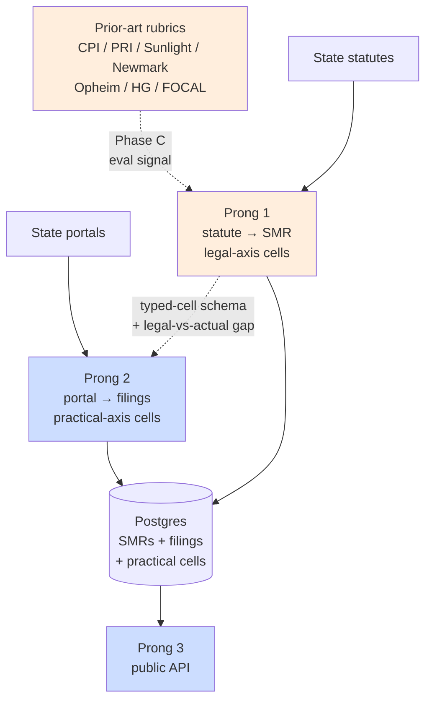
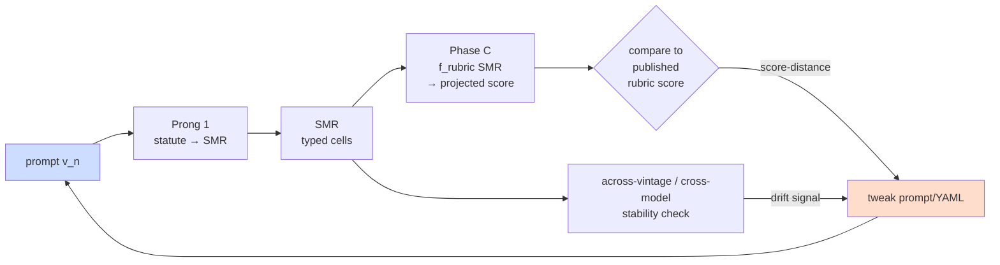

# Research Arc

Overview of the project's three prongs, how Prong 1 extraction actually works today, and the Ralph loop that measures it. This document captures *how the work fits together*; per-component depth lives in each branch's `RESEARCH_LOG.md`, and per-state coverage lives in `docs/STATE_COVERAGE.md`.

**See also:**
- `README.md` — project mission and positioning vs LobbyView / OpenSecrets / Sunlight / FOCAL
- `STATUS.md` — operational state per branch
- `docs/STATE_COVERAGE.md` — per-state edge×attribute coverage matrix (Prong 2's scoreboard)
- `docs/active/ARCHITECTURE.md` — production deployment topology (Prong 3); `docs/historical/backend-prototype/` — the shipped v0
- `docs/LANDSCAPE.md` — fellow-facing positioning report
- `compendium/README.md` — the 181-row contract this whole arc is built on

---

## Status (2026-06-12): Prong 2 leads; Prong 1 is in cross-state validation

**Prong 2 is the most mature prong.** WI and NY chains are released on `main` (`releases/wi/`, `releases/ny/`); OH extraction is validated at the 300-slice level with chain composition pending (#52). Prong 1 resumed extraction after the May pause (see history note below) via the **direct-read** harness on the **v2.1** typed-cell schema, and has completed its first cross-state validation round: 5 states (NY/WI/OH/CA/TX) × vintage 2015 against the CPI 2015 C11 published oracle, **19/30 (63.3%) per-(state, indicator) match post-Phase-1 vocab fix**. Round 2 (CO/IL/WA/FL/NC, ~$15) is pending (#50). Prong 3 has a shipped v0 prototype (FastAPI + Postgres + React explorer on real WI data, archived to `docs/historical/backend-prototype/`); the GraphQL + MCP production topology in `ARCHITECTURE.md` remains the design target.

**History note — the 2026-05-24 pause and what superseded it.** The OH 2025 pilot showed frontier LLMs *can* read statutes (stable, cheap, no hallucinated citations) but that the typed-cell schema forced lossy encodings on qualitative-trigger states (OH's "main purpose" lobbyist gate has no dollar floor for a numeric threshold cell to hold). The pause's prescription — gather freeform answers first, then design a **v2.2** schema from observed reality — was superseded twice:

1. **The additive-prompt track resumed extraction on v2.1.** The Phase B Ralph iterations (`wi-ralph-cpi-renewal-cadence`) established that per-row, cell-type-aligned prompt additives fix the extraction failures the pause attributed to the schema — without schema changes. Phase A then applied that pattern at scale (163 YAML additives across the row set), and the cross-state round ran on the result.
2. **The SMR-as-canonical principle (2026-06-06) mooted most of the v2.2 framing.** See Operating principles below: the residual cell-type-vs-rubric-tier mismatches are *projection-translation engineering*, not schema redesign.

v2.2 remains a label for the *next* compendium generation (there is a real v2.2 design ledger, e.g. the `regime` axis gap in `docs/STATE_REGIME_SPLITTING.md`), but it is no longer the gating step the May framing made it.

---

## Operating principles

Three load-bearing principles landed in June 2026 that reshape how the rest of this document should be read.

### SMR-as-canonical (2026-06-06)

**The SMR is the canonical statute-literal record; projection functions translate per-rubric; matching prior art is a CHECK, not the goal.** When the extraction's cell value and a published rubric's tier disagree because the cell type is statute-shaped (e.g., `renewal_cadence` as IntCell months) while the rubric scores a 3-tier categorical, the fix belongs in the projection helper, not the schema. The Phase 1 vocab fix that lifted Round 1 from 15/30 to 19/30 is the existence proof: helpers were updated to accept CPI's published vocabulary and the IntCell-months shape, the YAML's statute-literal extraction was untouched, and the lift matched the failure-mode doc's prediction exactly. This reframing converted cross-state Trends 1, 2, and 6 (vocab schism, compound-cell brittleness, cell-type-vs-tier divergence) from "v2.2 schema design questions" into projection-layer engineering.

### Anna Karenina (2026-06-06)

**Each state's disclosure pipeline is bespoke; shared infrastructure lives downstream of extraction.** WI needed IPF over semester marginals; OH's AER reduces to JOINs; NY's per-pair compensation disclosure needed neither but its `parties_lobbied` edge is grain-limited in its own way. Per-state idiosyncrasies live in per-state modules (`src/lobby_analysis/io/<state>/`, `allocation/<state>/`, `oh_portal/`); the WI legislature loader is OH's *template*, not its parent class. What amortizes across states is the canonical filing schema, the typed-cell schema, the projection functions, and the `releases/<state>/` format — all downstream. Refactoring toward a state-agnostic chain composer is premature generalization and should be resisted. Budget **~3 working days per state** for chain composition at TDD discipline; there is no "50 states in 80 days" extrapolation from "3 states in 5 days." (An earlier version of this document claimed a "stairs of leverage" pattern in which the typed-cell schema makes per-state Prong 2 work collapse to field-mapping; that overstated the amortization. The schema is a shared *reference*, not a shared *pipeline*.)

### De jure only (2026-06-06, Prong 1's statute line)

Reading statutes answers "what does the law say," not "what actually happens." The cross-state validation line is **de-jure only** — combined-axis rows are verboten in its dispatch roster (the default 6 chunks are 90.3% legal-axis by design; CPI 2015 C11 is a de-jure rubric). The 3 remaining combined-axis rows are queued for Pattern-C splits (#51). De facto / practical availability is Prong 2's axis, observed from portals, not inferred from statutes.

---

## Three prongs

**The product is Prong 2 + Prong 3** — public-facing infrastructure for state lobbying disclosure data, queryable by journalists, activists, and researchers who want to see *what's actually being disclosed* and *who is trying to influence whom*.

Prong 1 (statute → SMR) is **upstream scaffolding**, not the product. It earns its keep two ways:

1. **A shared reference standard for Prong 2.** The typed-cell schema is the common vocabulary for what each state's regime *should* be disclosing. Per Anna Karenina, it does not make per-state extraction cheap — extraction stays bespoke — but it anchors the canonical `LobbyingFiling` schema, the per-state coverage matrices in `STATE_COVERAGE.md`, and the release format that every state's output lands in.
2. **An additional research artifact.** The gap between what the statute *requires* (legal-axis cells, Prong 1) and what the portal *actually exposes* (practical-axis cells, Prong 2) is itself observable and queryable. A state whose statute mandates contact-log disclosure but whose portal doesn't surface them is a story.


```mermaid
flowchart TB
    PA[Prior-art rubrics<br/>CPI / PRI / Sunlight / Newmark<br/>Opheim / HG / FOCAL]
    S[State statutes]
    P[State portals]

    PA -.->|Phase C<br/>eval signal| P1
    S --> P1[Prong 1<br/>statute → SMR<br/>legal-axis cells]
    P --> P2[Prong 2<br/>portal → filings<br/>practical-axis cells]
    P1 -.->|typed-cell schema<br/>+ legal-vs-actual gap| P2

    P1 --> DB[(Postgres<br/>SMRs + filings<br/>+ practical cells)]
    P2 --> DB
    DB --> P3[Prong 3<br/>public API]

    style P1 fill:#fed
    style P2 fill:#cdf
    style P3 fill:#cdf
    style PA fill:#fed
```

Legend: light blue = product; sand = scaffolding.

| Prong | What it does | Role | Status (2026-06-12) |
|---|---|---|---|
| **1. Statute → SMR** | Read a state's lobbying statutes; emit one `StateMasterRecord` per (state, vintage) — typed cells covering what the regime *legally requires*. | Scaffolding | Direct-read harness operational; 5 states × vintage 2015 validated against CPI 2015 C11 (19/30 post-fix); Round 2 pending (#50) |
| **2. Portal → disclosure data** | Read a state's lobbying portal; extract structured filings + compose the principal→lobbyist→lawmaker→bill chain — what's *actually* disclosed. | Product | **Most mature prong.** WI released on main; NY released on main (merged 2026-06-12); OH extraction validated, chain pending (#52); MI/NC recon. See `STATE_COVERAGE.md` |
| **3. Display** | Serve the unified data via public API. | Product | v0 prototype shipped (FastAPI REST + Postgres + React/Vite explorer, live-verified on WI data; `docs/historical/backend-prototype/`). GraphQL + MCP production topology designed in `docs/active/ARCHITECTURE.md` |

### Prong 2's three-axis architecture

Each state's chain composes from three data axes with very different sourcing economics:

1. **Lobbying disclosure — bespoke per state** (Anna Karenina). The principal↔lobbyist↔bill legs come from each state's own portal and filing forms, and the extraction + composition shape differs structurally per state (WI: IPF over semester marginals; NY: direct JOIN on per-pair compensation; OH: JOIN over per-(agent, employer, period) AERs with a natively-disclosed lobbyist↔lawmaker gift/meal layer neither WI nor NY has).
2. **Lawmaker↔bill — Plural Policy / Open States bulk CSV, all 50 states.** The sponsorship leg is the one genuinely uniform input: free bulk session CSVs with structured `ocd-person` IDs, the same join pattern for WI, NY, and (pending) OH. Primary sponsors only in v1; cosponsors deferred.
3. **Principal↔lawmaker money (campaign finance) — FollowTheMoney (#43), with a sunset caveat.** FTM normalizes state campaign-finance data with donor canonicalization and an industry taxonomy, and is the scoped source for the structurally-missing $-flow leg (per `wi-cfis-scoping`). **Caveat:** FTM is in sunset/integration mode pending the OpenSecrets merger — data current through the 2024 cycle, site unmaintained. Fine for 2025-vintage chains running a year behind; a real risk for fresh-cycle work. The reusable FTM ingest (#43) should treat the API as a deprecating dependency.

Stance (support/oppose) is structurally missing from WI, NY, and OH disclosure — the chains detect lobbying *activity*, not coalition *composition*. That absence is itself a compendium-side finding.

The rest of this document is about **Prong 1** and how its quality is measured.

---

## Prong 1 internals: how extraction actually works (direct-read)

**Input:** state statute bundle (per state, per vintage, plain text) + the Compendium row contract (v2.1: 183 rows / 186 typed-cell specs at `compendium/disclosure_side_compendium_items_v2.1.tsv`).

**Output:** one `StateVintageExtraction(state, vintage, run_id, cells: dict[(row_id, axis), CompendiumCell])` per (state, vintage) — the SMR, the typed-cell record of what the statute legally requires, with `ExtractionRun` provenance (`run_id`, `model_version`, `prompt_sha`, timestamps).

**The extraction path is direct-read** (primary since the 2026-05-18 pivot): the *entire statute bundle goes into the model's context* alongside one chunk's worth of cell prompts, and the model emits one `record_cell` tool call per cell. There is no retrieval step. Concretely, per dispatch:

- Prompts come from the YAML SSOT (`compendium/source_quotes.yaml`), rendered with **opaque row handles** (`row_NNN` — row IDs are never leaked to the model) and **cell-type-aligned response-format instructions** (the load-bearing Phase B finding: vocabulary must match the cell type — `true/false` for BinaryCell — not the source rubric's `YES/NO/100/50/0`).
- The dispatcher (`scripts/` tier-1 direct-read runner, state-keyed via required `--state`/`--vintage`) runs the **default 6 CPI-de-jure chunks × 2 models (`claude-opus-4-7` + `gpt-5.2`) × 3 runs**, with checkpoint/resume per (model, chunk, run) and per-call/per-session cost ceilings.
- Responses are parsed cross-SDK and instantiated against the `models_v2` typed-cell registry; instantiation failures are recorded per cell, not patched silently.

Component status, against the four-component design this section used to describe:

| Component | What it is | Status |
|---|---|---|
| `models_v2/` | Frozen Pydantic ABC (`CompendiumCell`) + 15 typed subclasses + the cell-spec registry (186 cells at v2.1's 183 rows). | Shipped; load-bearing on the live path |
| `chunks_v2/` | Hand-curated 15-chunk partition of the rows. The 6-chunk CPI-de-jure subset is the default dispatch roster (`_DEFAULT_CHUNKS`/`_RESOLVED_CHUNKS` split allows single-chunk dispatch). | Shipped; load-bearing on the live path |
| `retrieval_v2/` | Citations-API cross-reference walker. | Shipped and tested, but **off the live path** — direct-read superseded it. Retained for a future long-statute regime where full-bundle-in-context stops fitting |
| `scoring_v2/` | The planned Citations-grounded scoring component. | **Never built; superseded by direct-read.** Do not implement — the dispatcher + YAML SSOT + `record_cell` parsing is the production scoring surface |

> **Historical design (pre-2026-05-18) — kept for orientation, do not build against this.** The original four-component flow routed extraction through `retrieval_v2` (Citations API) into a `scoring_v2` component:
>
> ```mermaid
> flowchart TB
>     C[Compendium<br/>row specs<br/>cell registry]
>     S[State statutes<br/>per vintage]
>     C --> M[models_v2/]
>     C --> CH[chunks_v2/]
>     M --> R[retrieval_v2/<br/>Citations API]
>     CH --> R
>     S --> R
>     R --> SC[scoring_v2/<br/>never built]
>     M --> SC
>     CH --> SC
>     SC --> SMR[SMR]
>     style R fill:#eee
>     style SC fill:#eee
> ```
>
> The Tier-0 smoke test (2026-05-18→20) showed full-bundle direct-read was simpler and worked; everything since — WI Phase 2/3, the wide pass, Phase B Ralph, Phase A at scale, the cross-state round — ran through the direct-read dispatcher.

Practical-axis cells live in the same SMR schema but are *populated* by Prong 2 from portal observation, not by Prong 1 — and under the de-jure-only decision, the statute line doesn't dispatch combined-axis rows at all (#51 splits the 3 stragglers).

---

## How Prong 1 quality is measured: the Ralph loop — designed, then run

Prong 1's central open question: **how accurate is the LLM's typed-cell extraction?** There is no published 50-state ground truth at the typed-cell level — that's the gap the project fills. What does exist is **per-state published rubric scores** from prior-art rubrics. Projecting extracted cells through a rubric's scoring rule (`f_rubric(SMR_cells, vintage) → projected_score`) and comparing against the published score gives an indirect-but-real accuracy signal. Under SMR-as-canonical, read this correctly: **the published score is a check on extraction, not the optimization target** — a mismatch can mean extraction error, projection-translation error, *or* prior-art scoring judgment we'd defend disagreeing with (all three occurred in Round 1).


```mermaid
flowchart LR
    P[prompt v_n] --> EX[Prong 1<br/>statute → SMR]
    EX --> SMR[SMR<br/>typed cells]
    SMR --> PR[Phase C<br/>f_rubric SMR<br/>→ projected score]
    PR --> CMP{compare to<br/>published<br/>rubric score}
    CMP -->|score-distance| TW[tweak prompt/YAML]
    TW --> P
    SMR --> ST[across-vintage / cross-model<br/>stability check]
    ST -->|drift signal| TW

    style P fill:#cdf
    style TW fill:#fdc
```

**This loop is no longer a design — it has run.** The empirical record, in sequence:

- **Phase B Ralph (iters 1–5, `wi-ralph-cpi-renewal-cadence`, archived).** Per-row by-hand iteration on WI against CPI 2015 C11 per-item oracle cells, across 4 cell types (IntCell, EnumCell, DecimalCell-Optional, BinaryCell). Each converged 6/6 (2 models × 3 runs) after **additive, cell-type-aligned prompt clarifiers** — the pattern is purely additive (confirmed by ablation) and the vocabulary must align with the *cell type*, not the source rubric. Total spend $3.51.
- **Phase A at scale.** The additive pattern applied as a pre-flight YAML audit: 163 cell-type-aligned additives (150 bulk BinaryCell + hand-crafted enum/decimal), 167 tests, dispatch-verified on 3 representative chunks ($0.83, 0 instantiation errors outside the one deliberately-deferred TimeThresholdCell row).
- **Cross-state Round 1 (`cross-state-cpi-2015-validation`, active).** 5 states (NY/WI/OH/CA/TX) × vintage 2015 × 6 chunks × 2 models × 3 runs = **180 dispatches / $14.43**. Pre-fix: 15/30 (50%) per-(state, indicator) exact match on CPI's 3-tier {0, 50, 100} scale. **Post-Phase-1 helper vocab fix: 19/30 (63.3%)** — the +4 lift matched the failure-mode doc's Trend-1 prediction exactly, with zero re-dispatch (stored extractions re-projected through fixed helpers). Per-state post-fix: NY **6/6** · WI 4/6 · CA 3/6 · TX 3/6 · OH 2/6.
- **Noise floor: measured, not hypothetical.** Per-state σ_noise (fraction of cells stable across the 3 runs): Claude 73.8% (TX) – 92.9% (OH); GPT 60.7% (TX) – 88.1% (NY/WI). NY (90.5%/88.1%) beat the WI training-surface baseline — the Phase A additives did not overfit to WI. Instantiation errors 2.9% (12/420 cell-dispatches), under the 5% pause threshold.

**The six Round 1 failure-mode trends** (full doc: `cross-state-cpi-2015-validation` `results/20260606_failure_mode_trends_and_paths_forward.md`) sort cleanly under SMR-as-canonical: Trends 1/6/2 (vocab schism, cell-type-vs-tier divergence, compound-cell brittleness) are **projection-translation engineering** — Trend 1's fix already shipped as Phase 1; Trends 3/5 are **prior-art interpretation gaps** (e.g., WI/OH IND_197: the model's literal `$0 threshold` reading of "any economic consideration" vs CPI's MODERATE — both defensible; two CPI errata candidates are documented); Trend 4 is a **data-input problem** (TX's single-file 2015 bundle drives over-projection — fix is bundle completeness, not prompts).

### Phase C: rubric projections (mostly shipped)

`phase-c-projection-tdd` (archived 2026-05-24) shipped the projection functions in the locked order. Current state:

| # | Rubric | Status |
|---|---|---|
| 1 | CPI 2015 C11 | **Shipped + exercised** — the cross-state Round 1 oracle (per-item × per-state, 700 cells; the gold-standard granularity) |
| 2 | PRI 2010 | Shipped (note: disclosure-law ground truth is per-*category* × per-state, not per-item — coarser than CPI) |
| 3 | Sunlight 2015 | Shipped |
| 4 | Newmark 2017 | Shipped |
| 5 | Newmark 2005 | Shipped (reuses 2017's cell mappings) |
| 6 | Opheim 1991 | Blocked on 1988-89 statute data |
| 7 | HG "2007" | Deferred — **vintage correction:** the rubric is actually a May *2003* CPI survey (the 2007 date was a page-metadata artifact propagated through L-N); 2003-vintage statute retrieval isn't tractable yet |
| 8 | FOCAL 2024 | Plans 1+2 of 4 shipped (federal-LDA validated); Plans 3+4 are #53 |

LobbyView 2018/2025 remains a schema-coverage check, not a score projection.

### Loop economics and risks, updated against actuals

**Cost.** Real numbers replace the old estimates: a full 5-state × 1-vintage × 6-chunk × 2-model × 3-run round is **~$14–15** ($2.48–$3.79 per state); a single-row Ralph iteration is ~$0.30–0.40; helper-side fixes and re-audits of stored extractions are **$0**. The expensive unit is dispatch; the audit machinery re-projects stored YAML for free, which is why remediate-then-re-audit is so cheap relative to remediate-then-re-dispatch.

**Implicit weighting in any aggregate loss** is still a live choice (per-rubric normalization vs raw sum) — currently moot because only CPI is being validated cross-state, but it returns the moment a second rubric joins the oracle set.

**Goodhart.** Still the named risk: tuning toward projection-distance can produce cells that *project well* rather than cells that *are correct*. SMR-as-canonical is the structural mitigation — the YAML stays statute-literal and the projection layer absorbs rubric-specific translation, so "make the oracle happy" pressure lands on deterministic helper code (reviewable, testable) rather than on the extraction prompts. Cross-model agreement and run-stability remain the checks that don't pass through any rubric.

### Milestone record

The "first Ralph-loop iteration" milestone this document used to define (scoring_v2 + CPI projection + OH 2015 bundle, across three branches) was achieved in substance — with direct-read in place of scoring_v2 — and the loop has since run at three scales (single-row Phase B, 3-chunk Phase A verification, 5-state Round 1). The current frontier is **Round 2: dispatch CO/IL/WA/FL/NC at vintage 2015 (~$15, #50)** to test the trends at N=10, then remediation decisions against that evidence (per the failure-mode doc's Path-2-modified recommendation).

---

## Out of scope for this document

- **Prong 2 internals** (per-state pipelines, chain composers, release formats). See `docs/STATE_COVERAGE.md` for the per-state coverage matrices and `releases/<state>/README.md` for each released artifact's self-contained primer. No longer "sibling work when started" — it's the bulk of the shipped value.
- **Prong 3 internals.** Production design in `docs/active/ARCHITECTURE.md`; the shipped v0 in `docs/historical/backend-prototype/`.
- **Per-rubric projection logic.** Mapping docs in `docs/historical/compendium-source-extracts/results/projections/`; implementations in `src/lobby_analysis/projections/`.
- **The compendium itself.** `compendium/README.md` + the row-freeze decision log; v2.1 schema-bump rationale on the archived `wi-ralph-cpi-renewal-cadence`.

## Open empirical questions

The pre-pivot questions about Citations-API behavior at scale, the quoted-span cap, and Prong 1↔2 retrieval-surface reuse are **mooted by the direct-read pivot** (no Citations on the live path; Prong 2 extraction is bespoke per Anna Karenina). Current open items, all with concrete next actions:

- **Do the Round 1 trends hold at N=10?** Round 2 dispatch (#50) doubles the comparison set to 60 cells; Trends 4 (sparse-corpus over-projection) and 5 (CPI audit-generosity) are 1–3 cells each at N=5 and need the larger sample before remediation commits.
- **Trend 5 disambiguation:** is the 4-of-5 IND_207 miss CPI scoring generosity or a statute-bundle gap? Read WI §13.74 against CPI's IND_207 source quote side-by-side (~30 min, $0).
- **TX sparse corpus:** does TX 2015 have lobbying-relevant sections the bundle missed, or a genuinely thin regime? Retrieval-side check, independent of the dispatch pipeline.
- **OH IND_203 `principal_required=False`** — OH-specific statutory pattern or extraction miss?
- **Score-distance threshold for "good enough."** Now expressible against measured baselines (σ_noise per state, 19/30 current match rate) but the bar itself is still an open call — and under SMR-as-canonical it is explicitly *not* 30/30, since some residual is defensible disagreement with prior-art scoring. Publishing the legal-vs-actual gap as a finding needs a tighter bar than using the schema as Prong 2's reference.
- **Combined-axis Pattern-C splits (#51)** — the 3 remaining rows blocking a fully de-jure dispatch roster.
- **Cross-vintage stability at scale.** Same-state multi-vintage extraction (the old Track A design) remains unexercised beyond the OH pilot; deliberately deferred as a separate research line (2025 has no CPI oracle — it tests stability, not accuracy).
